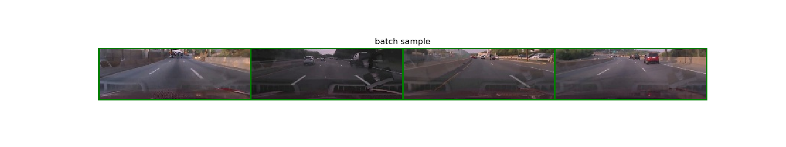
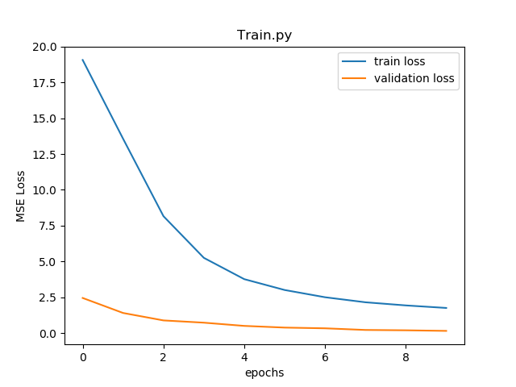

## 1. 개요

 동영상 파일과 프레임별 조향값이 들어있는 csv파일을 End to End 모델로 학습시켜 확인하는 것을 목표로 한다.

<br>

## 2. 실행 환경

* Ubuntu 18.04
* Python 2.7
* Pytorch 1.4.0 with Cuda 10.1
* pandas 0.24.2
* numpy  1.13.3
* matplotlib 2.1.1
* OpenCV 3.2.0

<br>

## 3. 데이터 준비

* /videos 에 학습시킬 동영상 준비
```
/videos
  └─ video1.mkv
  └─ video2.mkv
  └─ ...
```
* /datas 에 프레임별 조향값이 있는 csv 파일 준비
```
/datas
  └─ 1.csv
  └─ 2.csv
  └─ ...

# 1.csv example
ts_micro,frame,wheel
1464650070285914,0,-1
1464650070319247,1,-1
1464650070352581,2,-1
...
1464650070685914,12,-1.5
1464650070719247,13,-1.5
```

<br>

## 4. 구성

### video2img.py

* 실행시 videos에 있는 동영상을 프레임별로 모델 input 규격에 맞게 crop/resize후 image로 저장
```
/datas
  └─ track1
  │   └─ 0.jpg
  │   └─ 1.jpg
  │   └─ ...
  └─ track2
  │   └─ 0.jpg
  │   └─ 1.jpg
  │   └─ ...
  └─ ...
```

### model.py

* 사용 모델 (https://github.com/Zhenye-Na/e2e-learning-self-driving-cars 에서 살짝 변형)


### dataset.py

* 파이토치의 DataLoader Class를 활용하기 위한 Dataset 클래스 

* 활용 예시
```
# ./data에 있는 track1~ track9 에 있는 이미지 파일들을 데이터로 활용
dataset = TrackDataset(1, 9, "./datas") 

# batchsize / shuffle / multithread 설정하여 학습시킬 배치를 생성
dataloader = DataLoader(train_dataset, batch_size=8, shuffle=True, num_workers=2)
```
* batchsize = 4 일시 생성된 batch 예



### train.py

* 학습파일
* batchsize = 32 / epochs = 100 으로 설정
* Adam Optimizer 사용, learning rate = 0.0001, L2 페널티를 살짝 주었음 
* 33, 66 번째 epoch시 learning rate를 1/4 씩 줄이도록 설정
* MSELoss 손실함수 사용
* 10 epoch 마다 weight파일을 저장
* 학습 예시 (첫 10 epochs)


### viewer.py

* 동영상과 학습 weight 설정 후 실제 조향값과 예측한 조향값을 비교
* 실행 영상

[](https://www.youtube.com/watch?v=hBj9_rzrtlI)

<br>

### 5. 참고 자료

* https://arxiv.org/pdf/1604.07316v1.pdf : 원본 논문
* https://github.com/Zhenye-Na/e2e-learning-self-driving-cars : 베이스 모델
